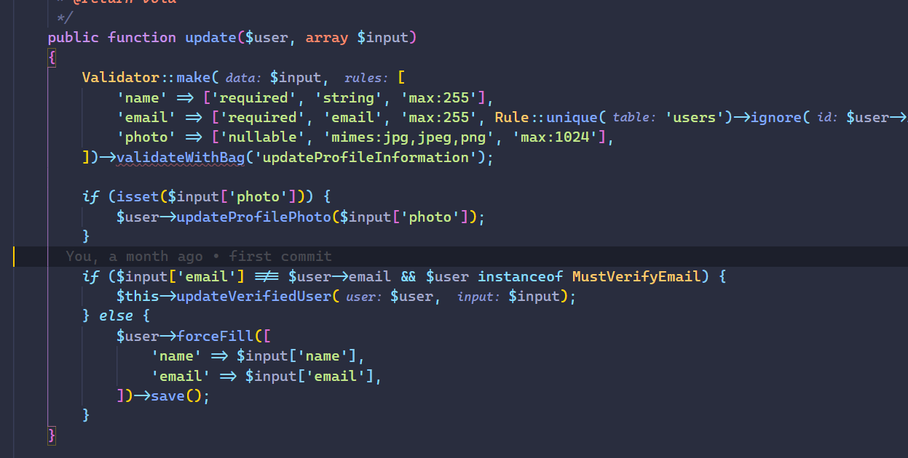

# PHP Parameter Hint for Visual Studio Code

[](https://marketplace.visualstudio.com/items?itemName=MrChetan.phpstorm-parameter-hints-in-vscode)
[](https://marketplace.visualstudio.com/items?itemName=MrChetan.phpstorm-parameter-hints-in-vscode)
[](https://marketplace.visualstudio.com/items?itemName=MrChetan.phpstorm-parameter-hints-in-vscode)



Inserts parameter hints(type, name or both) into function calls to easily understand the parameter role.

**Note:** This extension now uses VS Code's native Inlay Hints API, which properly respects word wrap and integrates seamlessly with the editor. Styling is controlled by your VS Code theme for consistency.


# Installation

- Open VS Code and click on Extensions Icon in the Activity Bar.
- Type **mrchetan.phpstorm-parameter-hints-in-vscode**
- Install the Extension Pack.
---

## Settings

| Name                                      | Description                                                                                                                                           | Default  |
| ----------------------------------------- | ----------------------------------------------------------------------------------------------------------------------------------------------------- | -------- |
| `phpParameterHint.enabled`                | Enable PHP Parameter Hint                                                                                                                             | true     |
| `phpParameterHint.onSave`                 | Create parameter hints on document save                                                                                                               | true     |
| `phpParameterHint.saveDelay`              | Delay in ms for on document save run                                                                                                                  | 250      |
| `phpParameterHint.onChange`               | Create parameter hints on document change                                                                                                             | true    |
| `phpParameterHint.changeDelay`            | Delay in ms for on document change run                                                                                                                | 100      |
| `phpParameterHint.textEditorChangeDelay`  | Delay in ms for on active text editor change                                                                                                          | 250      |
| `phpParameterHint.php7`                   | True if php version is 7.0+, false otherwise                                                                                                          | true     |
| `phpParameterHint.collapseHintsWhenEqual` | Collapse hint when variable name is the same as parameter name, keep the hint if the argument is passed by reference or if the splat operator is used | true    |
| `phpParameterHint.collapseTypeWhenEqual`  | Collapse type when it is equal to the variable name                                                                                                   | true    |
| `phpParameterHint.showFullType`           | Show full type, including namespaces instead of the short name                                                                                        | false    |
| `phpParameterHint.hintOnlyLiterals`       | Show hints only for literals                                                                                                                          | false    |
| `phpParameterHint.hintOnlyLine`           | Show hints only for current line/selection                                                                                                            | true    |
| `phpParameterHint.hintOnlyVisibleRanges`  | Show hints only for visible ranges                                                                                                                    | false    |
| `phpParameterHint.hintTypeName`           | Hint only name(0 - default) / Hint type and name(1) / Hint type(2)                                                                                    | 0        |
| `phpParameterHint.showDollarSign`         | Show dollar sign in front of parameter name                                                                                                           | false    |

## Commands

| Name                                   | Description                                                 | SHORTCUT                        |
| -------------------------------------- | ----------------------------------------------------------- | ------------------------------- |
| `phpParameterHint.toggle`              | Hide / Show Hints                                           | Key: CTRL + K H, Mac: CMD + K H |
| `phpParameterHint.toggleOnChange`      | Hide / Show Hints on text change                            | Key: CTRL + K O, Mac: CMD + K O |
| `phpParameterHint.toggleOnSave`        | Hide / Show Hints on document save                          | Key: CTRL + K S, Mac: CMD + K S |
| `phpParameterHint.toggleLiterals`      | Hide / Show Hints only for literals                         | Key: CTRL + K L, Mac: CMD + K L |
| `phpParameterHint.toggleLine`          | Hide / Show Hints only for current line/selection           | Key: CTRL + K I, Mac: CMD + K I |
| `phpParameterHint.toggleCollapse`      | Hide / Show Hints when variable name matches parameter name | Key: CTRL + K C, Mac: CMD + K C |
| `phpParameterHint.toggleTypeName`      | Hint name(default), type and name or only type              | Key: CTRL + K T, Mac: CMD + K T |
| `phpParameterHint.toggleCollapseType`  | Toggle collapsing type and name when they are equal         | Key: CTRL + K Y, Mac: CMD + K Y |
| `phpParameterHint.toggleFullType`      | Hide / Show full type name(namespaces including)            | Key: CTRL + K U, Mac: CMD + K U |
| `phpParameterHint.toggleVisibleRanges` | Hide / Show Hints only in visible ranges                    | Key: CTRL + K R, Mac: CMD + K R |
| `phpParameterHint.toggleDollarSign`    | Hide / Show dollar sign in front of parameter name          | Key: CTRL + K D, Mac: CMD + K D |

## Colors

**Note:** As of v2.2.0, the extension uses VS Code's native inlay hints styling. Customize the appearance using:

```json
"workbench.colorCustomizations": {
  "editorInlayHint.foreground": "#8D9BD6",
  "editorInlayHint.background": "#292D3E"
}
```

You can also use VS Code's native inlay hints settings:
```json
"editor.inlayHints.fontSize": 12,
"editor.inlayHints.fontFamily": "monospace"
```


**Enjoy Chetan's Extension Pack!**

[Contact Mr Chetan](https://mrchetan.com/)
